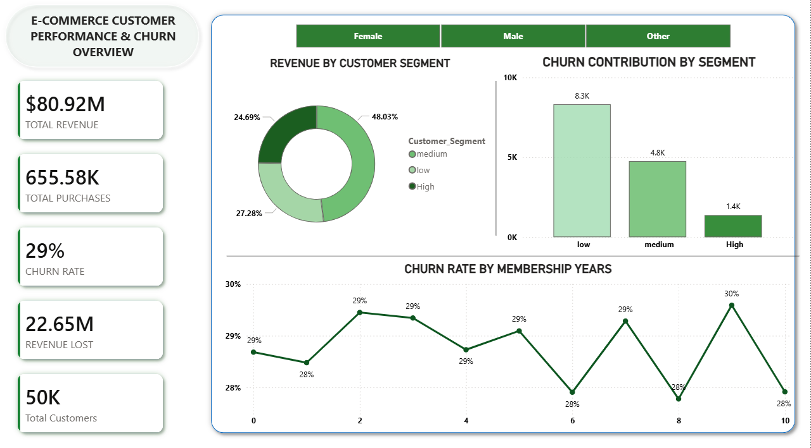

---

# 📊 E-Commerce Customer Churn Dashboard

## 📌 Overview

This project presents an **interactive Power BI dashboard** designed to analyze customer churn, engagement behavior, and revenue trends in an e-commerce business.

It helps identify **at-risk customers**, uncover revenue leakage, and support **data-driven retention strategies**.

> 💡 **Impact:** Identified high-churn customer segments and revenue loss patterns, enabling better decision-making and improved retention strategies.

---

## 🎯 Objectives

* Analyze customer churn behavior
* Evaluate revenue contribution across customer segments
* Identify key drivers influencing customer retention
* Support strategic decisions using actionable insights

---

## 🛠️ Tools & Technologies

* **Power BI** – Dashboard development & visualization
* **Microsoft Excel** – Data preprocessing
* **DAX (Data Analysis Expressions)** – Measures & calculations

---

## 📊 Data Overview

* **Dataset Source:** Kaggle (E-commerce Customer Behavior Dataset)
* **Records:** ~5,000+ entries *(update if exact known)*
* **Key Features:** Customer ID, Tenure, Purchase Frequency, Session Duration, Login Frequency, Region, Customer Segment
* **Target Variable:** Churn (Yes/No)

---

## 🧠 Data Processing & Modeling

* Cleaned missing and inconsistent data using Excel
* Built relationships between tables in Power BI
* Designed a **star schema data model**
* Created calculated columns and measures using DAX

---

## 📊 Dashboard Features

* **KPI Overview:** Revenue, Purchases, Churn Rate, and Revenue Loss
* **Customer Segmentation & Churn Analysis:** Segment-wise behavior and trends over time
* **Customer Insights:** Customer Lifetime Value (CLV) and engagement metrics
* **Geographic Analysis:** Region-wise churn distribution
* **Interactive Exploration:** Dynamic filters and slicers

---

## 🧮 Sample DAX Measures

```DAX
Churn Rate = 
DIVIDE([Churned Customers], [Total Customers])

Revenue Lost = 
CALCULATE(SUM(Sales[Revenue]), Sales[Churn] = "Yes")
```

---

## 📈 Key Insights

* Low-value customers show the **highest churn rate**
* Repeat customers contribute approximately **60% of total revenue**
* Higher engagement strongly correlates with **customer retention**
* Churn patterns vary across regions

---

## 💡 Business Recommendations

* Target low-value customers with retention campaigns
* Introduce loyalty programs for repeat customers
* Improve engagement through personalized offers
* Focus marketing efforts on high-churn regions

---

## 📸 Dashboard Preview

### Executive Overview



### Churn & CLV Analysis


---

## ▶️ How to Use

1. Download the `.pbix` file from this repository
2. Open using **Power BI Desktop**
3. Explore using filters and slicers

---

## 🚀 Future Improvements

* Implement churn prediction using machine learning
* Deploy dashboard to Power BI Service
* Add cohort and retention analysis
* Integrate real-time data pipelines

---

## 📂 Dataset

[https://www.kaggle.com/datasets/akshwint/ecommerce-customer-behaviour-prediction-dataset](https://www.kaggle.com/datasets/akshwint/ecommerce-customer-behaviour-prediction-dataset)

---

## ⭐ Support

If you found this project useful, consider giving it a **star ⭐** on GitHub!


If you want next:
👉 I can create a **high-impact LinkedIn post** for this
👉 Or help you build your **next AI/ML project (to impress recruiters even more)** 🚀
